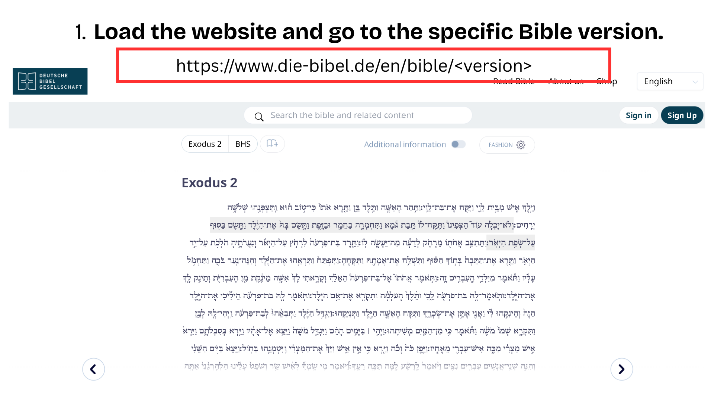
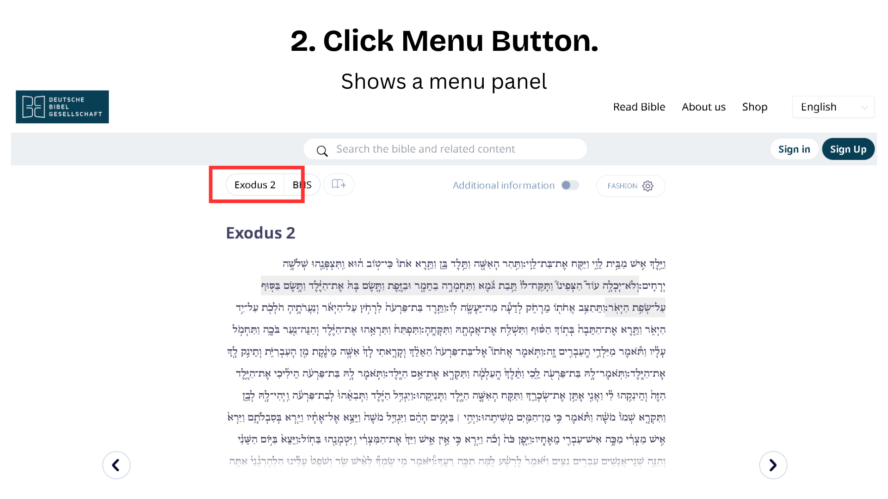
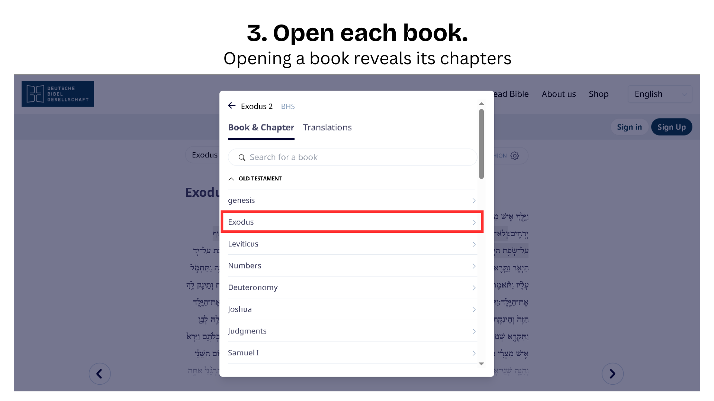
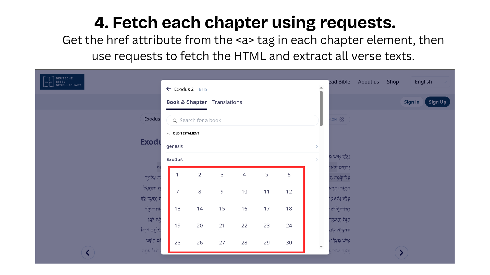
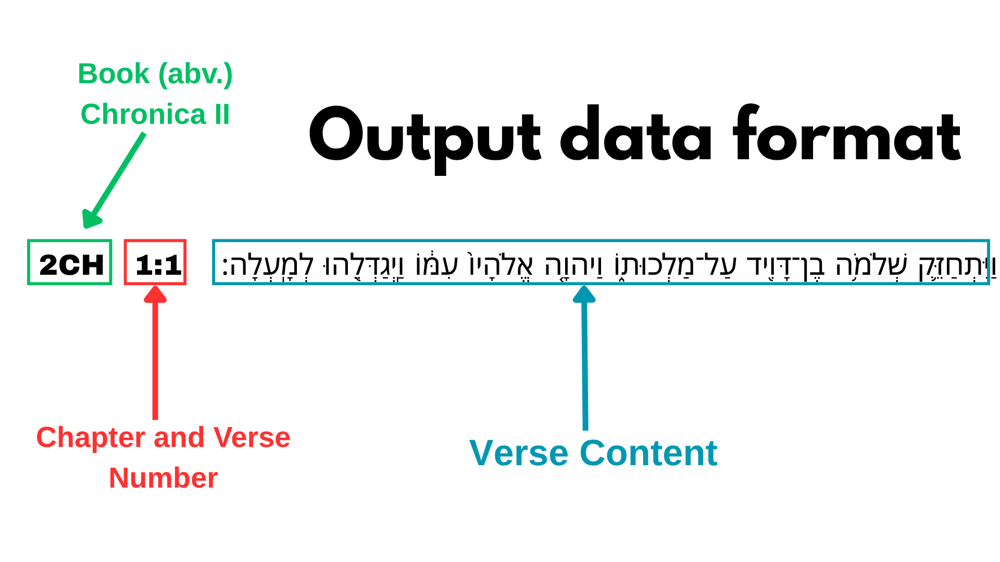

# Bible Website Scraper

A Python-based web scraping tool designed to extract biblical text data from die-bibel.de. This project systematically scrapes and organizes biblical content from multiple versions including Biblia Hebraica Stuttgartensia (BHS), Septuagint (LXX), Holy Bible Vulgate (VUL), and Greek New Testament(UBS5).

## Features

- Automated scraping of multiple Bible versions (e.g. BHS, LXX, VUL, UBS5)
- Structured data extraction for books, chapters, and verses
- Organized data storage in text database format

## Sample Usage

```
from .Website import BibleWebsite
from Driver.NormalDriver import NormalDriver
from .Menu import Menu
from .Book import Book
from .Chapter import Chapter
from .CookieHandler import CookieHandler
from Data.TextDatabase import TextDatabase

BASE_URL = "https://www.die-bibel.de/en/bible/"
BOOKS = ["BHS", "LXX", "VUL", "UBS5"]

driver = NormalDriver()
driver.set_up_driver()
driver_handle = driver.driver

menu_handler = Menu(driver_handle)
cookie_handler = CookieHandler(driver_handle)

for i in range(len(BOOKS)):
    website = BibleWebsite(
        f"{BASE_URL}{BOOKS[i]}",
        driver=driver_handle,
        menu=menu_handler,
        book=Book,       
        chapter=Chapter,
        cookie_handler=cookie_handler
    )
    print("Scraping", BOOKS[i])
    text_db = TextDatabase(BOOKS[i])
    website.attach(text_db)
    website.open()
    website.scrape()

```
## Project Structure

```
BibleWebsite/
├── Application/         # Core application logic
│   ├── App.py          # Main application entry point
│   ├── Website.py      # Website scraping implementation
│   ├── Book.py         # Book-level scraping
│   ├── Chapter.py      # Chapter-level scraping
│   └── Menu.py         # Navigation menu handling
├── Book/               # Book-related interfaces
├── Chapter/            # Chapter-related interfaces
├── CookieHandler/      # Cookie management
├── Data/              # Data storage and handling
├── Driver/            # Web driver management
├── Helpers/           # Utility functions
├── Menu/              # Menu-related interfaces
├── Subject/           # Subject interfaces
└── Website/           # Website interfaces

```

## Illustrations

Here are some screenshots demonstrating the website scraping process:










## Prerequisites

- Python 3.x
- Chrome browser installed
- Required Python packages (see requirements.txt)

## Installation

1. Clone the repository:
```bash
git clone https://github.com/jhncdiamante/BibleBookVersionsScraper.git
cd BibleWebsite
```

2. Create and activate a virtual environment:
```bash
python -m venv venv
# On Windows
.\venv\Scripts\activate
# On Unix or MacOS
source venv/bin/activate
```

3. Install required packages:
```bash
pip install -r requirements.txt
```

## Usage

1. Ensure Chrome browser is installed on your system
2. Run the main application:
```bash
python -m Application.App
```


## Data Output

The scraper generates text files for each Bible version (BHS.txt, LXX.txt, VUL.txt, UBS5.txt) containing the extracted biblical text in a structured format.

Example: For bible version 'BHS'
```
2CH 1:1	וַיִּתְחַזֵּ֛ק שְׁלֹמֹ֥ה בֶן־דָּוִ֖יד עַל־מַלְכוּת֑וֹ וַיהוָ֤ה אֱלֹהָיו֙ עִמּ֔וֹ וַֽיְגַדְּלֵ֖הוּ לְמָֽעְלָה׃
2CH 1:2	וַיֹּ֣אמֶר שְׁלֹמֹ֣ה לְכָל־יִשְׂרָאֵ֡ל לְשָׂרֵי֩ הָאֲלָפִ֨ים וְהַמֵּא֜וֹת וְלַשֹּֽׁפְטִ֗ים וּלְכֹ֛ל נָשִׂ֥יא לְכָל־יִשְׂרָאֵ֖ל רָאשֵׁ֥י הָאָבֽוֹת׃
2CH 1:3	וַיֵּלְכ֗וּ שְׁלֹמֹה֙ וְכָל־הַקָּהָ֣ל עִמּ֔וֹ לַבָּמָ֖ה אֲשֶׁ֣ר בְּגִבְע֑וֹן כִּי־שָׁ֣ם הָיָ֗ה אֹ֤הֶל מוֹעֵד֙ הָֽאֱלֹהִ֔ים אֲשֶׁ֥ר עָשָׂ֛ה מֹשֶׁ֥ה עֶֽבֶד־יְהוָ֖ה בַּמִּדְבָּֽר׃
```


## License

This project is licensed under the MIT License - see the LICENSE file for details.

## Disclaimer

This project is provided for educational and personal use only. Please note the following:

1. This project is not affiliated with, authorized by, or connected to die-bibel.de or any of its operators.
2. The use of this software is intended for personal, non-commercial purposes only.
3. Users are responsible for ensuring their use of this software complies with die-bibel.de's terms of service and applicable laws.
4. The creator of this software is not liable for any damages, losses, or issues that may arise from its use.
5. Users are advised to respect website terms of service, including rate limiting and usage restrictions.
6. This software is provided "as is" without any warranties of any kind.

By using this software, you acknowledge and agree to these terms.


## Customization

This project is fully customizable.  
Feel free to modify it to suit your specific needs.

